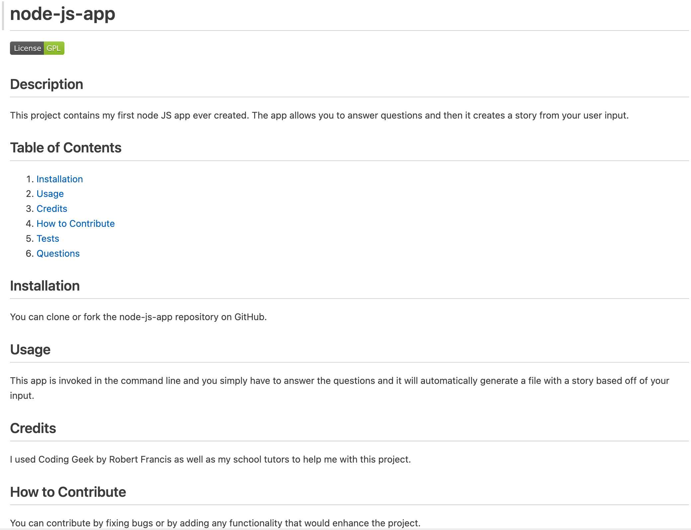

# command-line-readme

[Video Demonstrating App Functionality](https://watch.screencastify.com/v/8hpCk9EeqWhdG5uCT8wB)

[Link to Repo](https://github.com/crissyg923/command-line-readme)

## Description
This project is a readme generator that will help developers to focus more of their time on coding and less of their time on generating a formatted readme.  A readme is a file that should accompany every repository as it explains all of the necessary specifics of your application.  Those necessary specifics include a description, directions for installation, use and contribution, tests that were run, license information, and a section with contact information.  Simply put, the readme serves as your app's documentation and should contain high-quality and accurate information about your development. As I am moving through the Rutgers Full Stack Web, these weekly challenges are becoming a lot easier, but I still learned a lot through completing this challenge.  I was granted the opportunity to work with template literals, making my code much more efficient.  This was my first command line application, so that is also a major skill this challenge has helped me to gain.  Most importantly, I learned mnore tips on how to work with node which will be extremely beneficial on my path to becoming a web developer.

**Screenshot of Terminal**

**Screenshot of Sample Readme**

## Table of Contents

1. [Installation](#installation)
2. [Usage](#usage)
3. [Credits](#credits)
4. [How to Contribute](#how-to-contribute)
5. [Tests](#tests)
6. [Questions](#questions)

## Installation
Clone the command-line-readme repository to your local environment and create a new branch or fork the repo.  

## Usage
This application is invoked using node index.js in the terminal and  it creates the readme based off of your answers to the prompts.

## Credits
I used code from class lessons, Rutgers tutors, and class office hours to help finish this project.

## How to Contribute
Someone can contribute by adding extra features or finding and resolving any possible bugs.  I would also like to add a function to intake credit links from the user to be formatted and placed in the readme.

## Tests
N/A

## License
MIT
        Copyright (C) 2023 Crystal Green
        Permission is hereby granted, free of charge, to any person obtaining a copy
of this software and associated documentation files (the "Software"), to deal
in the Software without restriction, including without limitation the rights
to use, copy, modify, merge, publish, distribute, sublicense, and/or sell
copies of the Software, and to permit persons to whom the Software is
furnished to do so, subject to the following conditions:

The above copyright notice and this permission notice shall be included in all
copies or substantial portions of the Software.

THE SOFTWARE IS PROVIDED "AS IS", WITHOUT WARRANTY OF ANY KIND, EXPRESS OR
IMPLIED, INCLUDING BUT NOT LIMITED TO THE WARRANTIES OF MERCHANTABILITY,
FITNESS FOR A PARTICULAR PURPOSE AND NONINFRINGEMENT. IN NO EVENT SHALL THE
AUTHORS OR COPYRIGHT HOLDERS BE LIABLE FOR ANY CLAIM, DAMAGES OR OTHER
LIABILITY, WHETHER IN AN ACTION OF CONTRACT, TORT OR OTHERWISE, ARISING FROM,
OUT OF OR IN CONNECTION WITH THE SOFTWARE OR THE USE OR OTHER DEALINGS IN THE
SOFTWARE.`

## Questions
Crystal Green

(862) 205-9019

crystalgreen923@gmail.com

[Github](https://github.com/crissyg923)